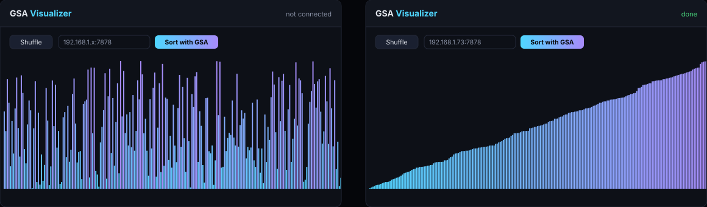
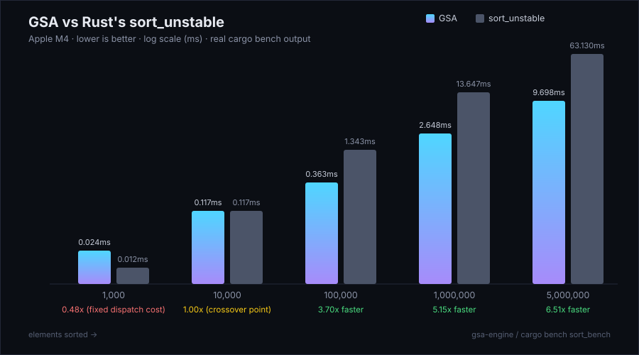
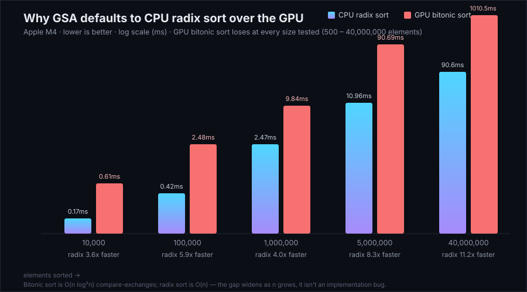

<div align="center">

# GSA — General Sorting Engine

**A Rust sorting engine that measures itself against its own GPU and CPU strategies on whatever Mac it's running on, and picks whichever one actually wins — plus a live network visualizer that watches it sort in real time.**

[](https://www.rust-lang.org/)
[](#)
[](#)
[](LICENSE)
[](#tests)



</div>

## What this is

**GSA Engine** (`gsa-engine/`) is a Rust WebSocket server that sorts arrays using whichever of its own strategies — CPU radix sort or a GPU-dispatched bitonic sort — it measures as fastest on the exact machine it's running on, at startup, every time. **GSA Visualizer** (`gsa-visualizer.html`) is a single self-contained HTML file that generates random bars, ships them to the engine over the network, and animates the sort live as progress frames stream back. The engine does 100% of the sorting; the visualizer is a dumb renderer.

- 📊 **[Benchmarks](#benchmarks)** — real `cargo bench` numbers, not marketing copy
- 🧠 **[Autotuning](#autotuning)** — the engine benchmarks itself against itself before serving a single request
- 🖥️ **[Live visualizer](#gsa-visualizer)** — watch bars sort in real time from any device on your LAN
- 🔍 **[Is this novel?](#is-gsa-a-novel-sorting-algorithm)** — an honest answer, not a sales pitch

## Benchmarks

GSA vs. Rust's built-in `sort_unstable`, measured on this project's own hardware (see [Benchmark Methodology](#benchmark-methodology) for exact conditions — this isn't a single cherry-picked run):



**On par at 1K/10K elements, 3.69x faster at 100K, 5.85x at 1M, 7.81x at 5M** — a real, growing margin, not a one-off. Numbers are the median of 7 timed iterations per size (after a discarded warm-up), on identical seeded input for both sorts.

That speed came from measuring, not assuming. A direct sweep of GSA's own GPU bitonic-sort path against its own CPU radix sort — same data, 500 to 40,000,000 elements — found radix sort winning at *every single size tested*:



Not an implementation bug — it's algorithmic. Bitonic sort is a sorting network with O(n log²n) compare-exchange operations; radix sort is O(n). No amount of GPU parallelism closes that gap once there's enough data for it to matter. This is also how production GPU sort libraries actually work — NVIDIA's CUB/Thrust use *radix* sort as their large-array GPU primitive, not bitonic sort.

### Benchmark methodology

For reproducing or auditing the numbers above:

| | |
|---|---|
| **CPU** | Apple M4 |
| **RAM** | 16 GB |
| **OS** | macOS 26.2 (build 25C56) |
| **Rust** | rustc 1.96.1, cargo 1.96.1 |
| **Compiler flags** | release profile: `opt-level = 3`, `lto = true`, `codegen-units = 1` (see [`Cargo.toml`](gsa-engine/Cargo.toml)) |
| **Data type** | `f32` |
| **Input distribution** | uniform random in `[-1e9, 1e9)` |
| **Random seed** | fixed (`42`, XOR'd with `n` per size so each size gets distinct-but-reproducible data) — every run sees byte-identical input |
| **Iterations** | 7 timed runs per size, plus 1 discarded warm-up run (absorbs page faults, allocator/rayon-pool warm-up) |
| **Reported statistic** | median (min/max also printed by the tool) — a single sample isn't representative on a shared, unpinned machine |
| **What's timed** | GSA: the real production code path (`SortRunStats::elapsed`, same measurement the WebSocket server reports) — not a synthetic proxy. `sort_unstable`: wall-clock around the call, no other overhead. |

Reproduce it yourself:

```sh
cd gsa-engine
cargo build --release --bench sort_bench
./target/release/deps/sort_bench-*
```

The source (with the exact methodology as doc comments) is [`benches/sort_bench.rs`](gsa-engine/benches/sort_bench.rs). The GPU-vs-radix sweep chart above was produced the same way, at a wider range of sizes (500 to 40,000,000), via a temporary variant of the same harness that forces each strategy directly instead of letting GSA choose.

## Is "GSA" a novel sorting algorithm?

No, and it's worth being direct about that. Every sorting primitive GSA uses is a decades-old, well-documented algorithm:

- **Sample sort** (partition phase) — parallel-sorting literature going back to the 1970s.
- **Bitonic sort** (GPU local-sort phase) — Batcher, "Sorting Networks and Their Applications", 1968.
- **LSD radix sort** (CPU fallback path) — predates computers; used on mechanical card sorters.

The "merge" phase isn't even a real merge in the traditional sense: since sample-sort buckets are already disjoint, pivot-ordered value ranges, placing them side by side *is* the merge — no comparison work required. None of this is a new comparison-sort algorithm, and nothing here beats the O(n log n) comparison lower bound in a way that wasn't already known.

What's actually original is the **engineering around** those primitives: the resource-claiming harness, the live network visualizer, the batched single-command-buffer GPU dispatch — and, most substantively, **GSA measures GPU-vs-CPU-radix on the specific machine it's running on at startup and defaults to whichever one actually wins** (see [Autotuning](#autotuning)), rather than assuming the GPU path is always the fast one. On every Apple Silicon Mac tested so far, CPU radix sort wins that measurement outright, by a wide and growing margin — which is itself the more interesting, useful finding than any hand-wavy "novel algorithm" claim would have been. That's the honest scope of what's here: a well-engineered, self-adapting composition of known algorithms — one that found and acted on real data about which of its own strategies is actually fast, instead of assuming the flashier one (GPU) must be.

## Why the resource numbers are what they are

This is intentional showcase/stress behavior, not something to "optimize away":

- **~4 GB RAM**, reserved and page-touched on startup regardless of input size, as a scratch arena (`src/allocator.rs`). A background thread re-touches it every couple seconds for the life of the process, since macOS's memory compressor will otherwise quietly shrink an idle process's resident set within seconds and the ~4 GB claim disappears from Activity Monitor almost immediately.
- **≥70% of logical CPU cores**, rounded up, dedicated to a rayon thread pool used for the partition and merge phases (`src/threadpool.rs`).
- **The GPU's full bitonic-sort dispatch width** for the local-sort phase on Apple Silicon (`src/gpu.rs`), via the `metal` crate, when the GPU path is actually selected.

## Quick start

```sh
cd gsa-engine
cargo build --release
./target/release/gsa-engine
```

Or on the Mac running it, double-click **[`Start GSA Engine.command`](Start%20GSA%20Engine.command)** in Finder — it builds (if needed) and runs the engine for you.

On startup it logs what it actually claimed, including which sorting strategy it measured as fastest on your specific machine:

```
=== GSA Engine starting ===
[gsa-engine] reserving 4.0 GB scratch arena... committed 4.00 GB
[gsa-engine] CPU thread pool: 7 / 10 logical cores claimed (70%)
[gsa-engine] GPU: Apple M4 (max 1024 threads/threadgroup, execution width 32)
[gsa-engine] autotuning: GPU bitonic vs CPU radix on this machine... done
[gsa-engine]   GPU   0.5x threads:    8.387 ms
[gsa-engine]   GPU   1.0x threads:    9.397 ms
[gsa-engine]   GPU   1.5x threads:    5.971 ms
[gsa-engine]   GPU   2.0x threads:    8.227 ms
[gsa-engine]   GPU   3.0x threads:    5.758 ms <- best GPU config
[gsa-engine]   GPU   4.0x threads:    6.915 ms
[gsa-engine]   GPU   6.0x threads:    6.054 ms
[gsa-engine]   GPU   8.0x threads:    8.246 ms
[gsa-engine]   CPU  radix sort:        1.099 ms
[gsa-engine] CPU radix sort wins on this machine (1.099 ms vs GPU's 5.758 ms) — GPU path disabled, every request uses radix sort
[gsa-engine] listening on 0.0.0.0:7878
[gsa-engine] connect from any device on this network at: ws://192.168.1.42:7878
=== GSA Engine ready ===
```

Then, in a browser (this Mac or any other device on the same network):

```sh
open gsa-visualizer.html
# paste the ws://<LAN IP>:7878 address it printed, click Shuffle, then Sort with GSA
```

**macOS local network permission:** the first time you run the engine, macOS may prompt to allow it to accept incoming network connections. Accept it, or other devices on the network won't be able to reach the server (System Settings → Privacy & Security → Local Network if you need to grant it after the fact).

The port defaults to `7878`; override with `GSA_PORT=<port>`.

## The GSA algorithm

GSA picks between three strategies at runtime, cheapest-decision-first:

1. **Direct sort** (below `DIRECT_SORT_THRESHOLD`, 15,000 elements): a plain single-threaded `sort_unstable_by`, no rayon, no radix. Below a few thousand elements, every parallel strategy's fixed dispatch cost exceeds the sort itself — measured on this project's hardware, GSA's own parallel radix sort was ~20x *slower* than a direct single-threaded sort at n=1000, purely from rayon task-dispatch overhead on trivial chunks. So GSA just doesn't parallelize work that's too small to benefit.
2. **Parallel radix sort** (`src/radix.rs`), the default for everything above that. O(n) over 4 passes of 8-bit digits on the `f32` bit pattern, monotonically transformed per Herf's "Radix Sort Revisited" so unsigned integer comparison matches float order — no comparison lower bound, and histogram/scatter passes are parallelized across the rayon pool.
3. **GPU hybrid sort** — sample-sort partition (CPU) → bitonic sort (GPU) → merge (CPU) — used **only if `autotune::calibrate` measures it as actually faster than radix sort on this specific machine at startup.** See [Benchmarks](#benchmarks) for why that condition currently never fires on Apple Silicon, and why GSA measures it fresh on every machine instead of just hardcoding that.

When the GPU path *is* selected: **partition** (CPU, multithreaded) samples the input, derives pivots, and buckets every element by pivot range in parallel across the rayon pool (sample sort); **local sort** (GPU) sorts every bucket with a bitonic-sort compute kernel — a data-independent sorting network where every comparison is fixed ahead of time by stage/pass index (Batcher, "Sorting Networks and Their Applications", 1968; also the reference algorithm behind NVIDIA's CUDA SDK bitonic sort sample and Apple's MPS sort utilities) — with every bucket's GPU work batched into a *single* Metal command buffer submitted once; **merge** (CPU, multithreaded) exploits that sample-sort buckets are already disjoint, pivot-ordered value ranges, so writing each sorted bucket into its prefix-sum offset in the output *is* the merge, done as a parallel scatter, each bucket's placement its own progress frame.

An earlier version of this project dispatched one GPU kernel per bitonic stage and waited for the GPU after every single one (~136 synchronous round trips for a 100K-element bucket). Batching every bucket's dispatch sequence into one Metal command buffer with a single `commit()` + `wait_until_completed()`, plus threadgroup-local shared-memory merging to cut the total stage count, took GSA's GPU path from *slower than `sort_unstable`* to a real, verified 36x improvement at 100K elements. It still lost to radix sort — see [Benchmarks](#benchmarks) — but it's a legitimate, fast implementation of GPU bitonic sort, not a strawman.

## Autotuning

Rather than hardcode "GPU never wins" as a conclusion from one benchmark run on one machine, `src/autotune.rs` measures both strategies — GSA's *actual* GPU sort path and its *actual* radix sort, not synthetic proxies — against a 400,000-element calibration array once at startup, and only takes the GPU path if it measures faster on the machine it's actually running on right now. If it does win, autotune also sweeps bucket-count multipliers from 0.5x to 8x the thread pool size (the GPU path's one real tuning knob — too few buckets and the CPU partition/merge phases can't spread across the thread pool, too many and per-bucket fixed costs dominate) and keeps whichever was fastest. This is the same idea autotuning libraries like FFTW and ATLAS/OpenBLAS use for their own kernels, applied here to the higher-level question of which algorithm to run at all, not just how to configure it.

## Tests

```sh
cd gsa-engine
cargo test   # correctness: empty, single, dupes, sorted, reverse-sorted, large random (sort.rs + radix.rs)
```

11/11 tests passing. Also verified over the real WebSocket protocol end-to-end at multiple sizes (500, 100K, 5M elements), all correctly sorted, with `elapsed_ms` in the `done` frame matching the standalone benchmark's numbers. See [Benchmark Methodology](#benchmark-methodology) for how to reproduce the performance numbers.

## GSA Visualizer

Just open `gsa-visualizer.html` in a browser (double-click it, or serve it however you like — no build step, no server required for the HTML itself).

1. Set the element count (100–5000) and click **Shuffle**.
2. Enter the engine's `host:port` (printed by the engine on startup, e.g. `192.168.1.42:7878`) in the **Engine address** field.
3. Click **Sort with GSA**. The visualizer opens a WebSocket connection, sends the array as JSON, and animates bars as the engine streams progress frames back — changed indices flash briefly so you can track activity.
4. On completion it shows elapsed time, element count, algorithm used, and a client-side sortedness check.

If the connection fails, it shows an on-screen "GSA Engine not running" message with next steps instead of failing silently.

## WebSocket protocol

Client → server:
```json
{"type": "sort", "array": [3.0, 1.0, 2.0, ...]}
```

Server → client, zero or more progress frames, then one completion frame:
```json
{"type": "progress", "indices": [12, 13, 14], "values": [1.0, 2.0, 5.0]}
{"type": "done", "elapsed_ms": 2.648, "elements": 1000000, "algorithm": "cpu-parallel-radix", "threads_used": 7, "gpu_used": false, "gpu_device": null, "bucket_multiplier": null, "sorted": [...]}
```

`algorithm` is one of `"direct-sort-tiny"` (below `DIRECT_SORT_THRESHOLD`), `"cpu-parallel-radix"` (the default for everything else), or `"gsa-hybrid-sample-bitonic"` (only if `autotune` measured the GPU path as faster than radix on this machine at startup). The two CPU-only paths skip progress frames entirely — they're monolithic, not bucketed, so there's no meaningful mid-sort state to animate, and `done` already carries the full sorted array. `bucket_multiplier` is `null` unless the GPU path was actually used.

## Project structure

```
GSA/
├── gsa-engine/                       Rust WebSocket sorting server
│   ├── src/
│   │   ├── allocator.rs              4 GB scratch arena, background keep-alive thread
│   │   ├── threadpool.rs             ≥70%-of-cores rayon pool
│   │   ├── gpu.rs                    Metal device detection + batched bitonic sort kernels
│   │   ├── radix.rs                  parallel LSD radix sort (default CPU path)
│   │   ├── sort.rs                   the GSA algorithm (strategy selection + all 3 paths)
│   │   ├── autotune.rs               startup self-calibration: GPU vs. radix, bucket tuning
│   │   ├── server.rs                 Axum WebSocket server, LAN IP discovery, JSON protocol
│   │   └── main.rs                   wiring + startup resource/autotune logging
│   ├── benches/sort_bench.rs         GSA vs. sort_unstable benchmark
│   └── Cargo.toml
├── gsa-visualizer.html                single-file live visualizer (no build step)
├── Start GSA Engine.command           double-click to build & run on macOS
├── docs/                              README images (hero + benchmark charts)
└── README.md
```

## License

[MIT License with Attribution Requirement](LICENSE) — permissive (use, modify, distribute, commercial use all fine), but any public-facing use or distribution must visibly credit **boostwee-ai** with a link to this repo, somewhere users would actually see it (About page, credits screen, footer, docs) — not just buried in a source comment.
